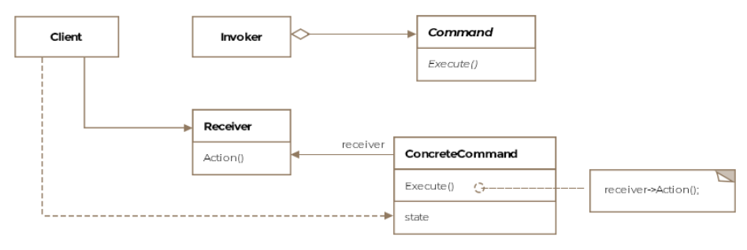

# Table of contents 
- [Table of contents](#table-of-contents)
- [Command Pattern](#command-pattern)
  - [How it works](#how-it-works)
- [Macro Command](#macro-command)
- [Caveats](#caveats)
- [Class Diagram](#class-diagram)
- [Use Cases](#use-cases)
- [Example in a Django Project](#example-in-a-django-project)
  - [Define the Command Interface](#define-the-command-interface)
  - [Define Concrete Commands](#define-concrete-commands)
  - [Define the Receiver](#define-the-receiver)
  - [Define the Invoker](#define-the-invoker)
  - [Usage example](#usage-example)

# Command Pattern
The command pattern's intention is to decouple the consumers of an action and the object which knows how to perform the action. Suppose you are designing a framework for UI, and you add the ability for the users of the framework to add a menu bar. The menu bar will consist of menu-items. When someone clicks on the menu-item some action will be performed. Since you are only building the framework, you don't know what actions the users of the framework can have. 

Formally, the pattern is defined as **representing an action or a request as an object that can be passed to other objects as parameters, allowing parameterization of clients with requests or actions. The requests can be queued for later execution or logged. Logging requests aneables undo operations**. 

## How it works 
1. **Command Interface**: Declares an interface for executing an operation. 
2. **Concrete Command**: Implements the command interface and defines the binding between a receiver and an action.
3. **Receiver**: Knows how to perform the operations associated with carrying our a request. 
4. **Invoker**: Asks the command to carry out the request. 
5. **Client**: Creates a concrete command and sets its receiver. 

# Macro Command 
A series of command can be strung together and executed in a sequence by another command object, sometimes called a macro command. It has no explicit receiver as the commands it sequences define their own receivers. The macro command is an example of the composite pattern. 

# Caveats 
- The command pattern is equivalent of a callback function in procedural languages as we parametrize objects with an action to perform. 
- The command objects can also be queued for later execution. 
- The command pattern offers a way to model transactions. A transaction consists of linear grained operations applied to data. 

# Class Diagram 


# Use Cases 
1. **Undo/Redo Operations**: Implementing undo and redo functionality in applications. 
2. **Macro Commands**: Executing a sequence of commands as a single command. 
3. **Logging Changes**: Logging changes to support auditing and rollback. 
4. **Task Scheduling**: Scheduling tasks to be executed at a later time. 
5. **GUI Buttons and Menus**: Decoupling the button click from the action performed. 

# Example in a Django Project
Let's consider a scenario where you want to implement a task management system where tasks can be added, executed and undone. 

## Define the Command Interface 
Create an interface that declares the execute and undo methods. 

```python 
# commands.py
from abc import ABC, abstractmethod 


class Command(ABC):
    @abstractmethod
    def execute(self):
        pass

    @abstractmethod
    def undo(self):
        pass
```

## Define Concrete Commands
Implement the concrete commands for adding and executing tasks. 

```python 
# concrete_commands.py
from .commands import Command 


class AddTaskCommand(Command):
    def __init__(self, task_manager, task):
        self.task_manager = task_manager
        self.task = task 

    def execute(self):
        self.task_manager.add_task(self.task)

    def undo(self):
        self.task_manager.remove_task(self.task)


class ExecuteTaskCommand(Command):
    def __init__(self, task_manager, tasks):
        self.task_manager = task_manager
        self.task = task 

    def execute(self):
        self.task_manager.execute_task(self.task)

    def undo(self):
        self.task_manager.unexecute_task(self.task)
```


## Define the Receiver
Implement the task manager that knows how to perform the operations. 

```python 
# task_manager.py 


class TaskManager:
    def __init__(self):
        self.tasks = []

    def add_task(self, task):
        self.tasks.append(task)
        print(f"Task '{task}' added.")

    def remove_task(self, task):
        self.tasks.remove(task)
        print(f"Task '{task}' removed.")

    def execute_task(self, task):
        print(f"Executing task '{task}'.")

    def unexecute_task(self, task):
        print(f"Undo executing task '{task}'.")
```


## Define the Invoker 
Implement the invoker that asks the command to carry out the request. 

```python
# invoker.py
class TaskInvoker:
    def __init__(self):
        self.history = []

    def execute_command(self, command):
        command.execute()
        self.history.append(command)

    def undo_last_command(self):
        if self.history:
            command = self.history.pop()
            command.undo()
```


## Usage example
Use the command pattern in views to manage the tasks 

```python 
# views.py 
from django.http import HttpResponse 
from .task_manager import TaskManager
from .concrete_commands import AddTaskCommand, ExecuteTaskCommand
from .invoker import TaskInvoker 


def manage_tasks(request):
    task_manager = TaskManager()
    invoker = TaskInvoker()

    add_task_command = AddTaskCommand(task_manager, "Task 1")
    execute_task_command = ExecuteTaskCommand(task_manager, "Task 1")

    invoker.execute_command(add_task_command)
    invoker.execute_command(execute_task_command)

    invoker.undo_last_command()

    return HttpResponse("Tasks managed successfully")
```