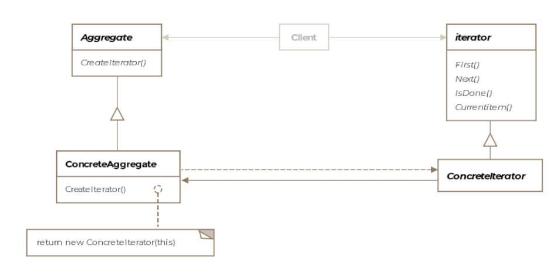

# Table of contents 
- [Table of contents](#table-of-contents)

# Iterator Pattern 
Iterate literally means to perform repeatedly. A for loop iterates over an array i.e. it accesses the array repeatedly. 

The iterator allows a consumer to go over the elements of a collection without knowing how the collection was implemented. It can be a list, array, hashmap, etc. 

Formally is defined as **a pattern that allows traversing the elements of an aggregate or a collection sequentially without exposing the underlying implementation**

The iterator pattern extracts out the responsibility of traversing over an agregate out of the agregate's interface and encapsulates it in the iterator class. 

## How it works 
1. Iterator Interface: Defines the methods for accessing and traversing elements. 
2. Concrete Iterator: Implements the iterator interface and keeps track of the current position in the traveral. 
3. Aggregate Interface: Defines the method(s) to create an iterator
4. Concrete Aggregate: Implements the aggregate interface and returns an instrance of the concrete iterator. 

# Use cases 
1. **Collections**: Traversing elements in collections like lists, arrays, hashmaps, etc. 
2. **Data Structures**: Implementing custom data structures that need to be traversed. 
3. **Tree Structures**: Traversing nodes in tree structures. 
4. **File systems**: Iterating over files and directories. 

# Class Diagram 


# Example in a Django Project
Consider an example of using this pattern in order to iterate over a collection of User objects. Useful for paginating user profiles or processing user data in batches. 

## Define the iterator interface 
Create an interface that declares the methods for accessing and traversing elements. 

```python 
# iterators.py 
from abc import ABC, abstractmethod


class Iterator(ABC):
    @abstractmethod 
    def has_next(self):
        pass

    @abstractmethod
    def next(self):
        pass
```


## Define the concrete iterator 
Implement the concrete iterator that keeps track of the current position in the traversal

```python 
# concrete_iterators.py 
from .iterators import Iterator 


class UserIterator(Iterator):
    def __init__(self, users, batch_size=10):
        self._users = users 
        self._index = 0
        self._batch_size = batch_size

    def has_next(self):
        return self._index < len(self._users)

    def next(self):
        if self.has_next():
            start = self._index
            end = min(self._index + self._batch_size, len(self._users))
            self._index = end
            return self._users[start:end]
        raise StopIteration
```


## Define the aggregate interface
Create an interface that declares the method to create an iterator

```python
# aggregates.py 
from abc import ABC, abstractmethod


class Aggregate(ABC):
    @abstractmethod 
    def create_iterator(self):
        pass
```


## Define the concrete aggregates 
```python
# concrete_aggregates.py
from .aggregates import Aggregate
from .concrete_iterators import UserIterator
from django.contrib.auth.models import User

class UserCollection(Aggregate):
    def __init__(self):
        self._users = list(User.objects.all())

    def create_iterator(self, batch_size=10):
        return UserIterator(self._users, batch_size)
```


## Usage example
Use the iterator pattern in a view to iterate over user profiles and display them in batches 
```python
# views.py
from django.http import HttpResponse
from .concrete_aggregates import UserCollection

def display_user_profiles(request):
    # Create a collection of user profiles
    user_collection = UserCollection()

    # Create an iterator with a batch size of 10
    iterator = user_collection.create_iterator(batch_size=10)

    # Iterate over user profiles and collect their information
    profiles = []
    while iterator.has_next():
        batch = iterator.next()
        for user in batch:
            profiles.append(f"User: {user.username}, Email: {user.email}")

    return HttpResponse("<br>".join(profiles))
```