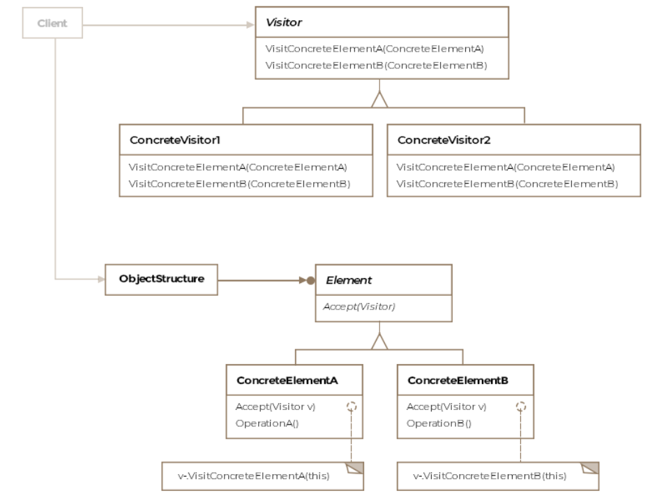

# Table of contents 
- [Table of contents](#table-of-contents)
- [Visitor Pattern](#visitor-pattern)
  - [How it Works](#how-it-works)
- [Use Cases](#use-cases)
- [Class Diagram](#class-diagram)
- [Example in Django Project](#example-in-django-project)
  - [Define the Visitor Interface](#define-the-visitor-interface)
  - [Define Concrete Visitors](#define-concrete-visitors)
  - [Define the Element Interface](#define-the-element-interface)
  - [Define Concrete Elements](#define-concrete-elements)
  - [Usage Example](#usage-example)

# Visitor Pattern 
The visitor pattern allows us to define an operation for a class or a class hierarchy without changing the classes of the elements on which the operation is performed. 

Formally, the pattern is defined as defining operations to be performed on elements of an object structure without changing the classes of the elements it works on.

## How it Works 
1. **Visitor Interface**: Declares a visit method for each type of elements in the object structure. 
2. **Concrete Visitor**: Implements the visitor interface and defines the operations to be performed on each type of element. 
3. **Element Interface**: Declares an accept method that takes a visitor as an argument. 
4. **Concrete Element**: Implements the element interface and defines the accept method to call the appropriate visit method on the visitor

# Use Cases 
1. **Object Structure**: When you have a complex object structure and you want to perform operations on these objects without modifying their classes. 
2. **Compilers**: Traversing and performing operations on abstract syntax trees. 
3. **UI Components**: Applying operations to a hierarchy of UI components. 
4. **File Systems**: Performing operations on files and directories.

# Class Diagram 


# Example in Django Project
Let's consider a scenario where you have a collection of different types of documents like PDF, word or excel and you want to perform different operations on these documents. 

## Define the Visitor Interface
Create an interface that declares the visit methods for each type of document. 

```python
# visitors.py
from abc import ABC, abstractmethod

class DocumentVisitor(ABC):
    @abstractmethod
    def visit_pdf(self, pdf):
        pass

    @abstractmethod
    def visit_word(self, word):
        pass

    @abstractmethod
    def visit_excel(self, excel):
        pass
```

## Define Concrete Visitors 
Implement the concrete visitors that define the operations to be performed on each type of document.

```python 
# concrete_visitors.py
from .visitors import DocumentVisitor

class PrintVisitor(DocumentVisitor):
    def visit_pdf(self, pdf):
        print(f"Printing PDF document: {pdf.name}")

    def visit_word(self, word):
        print(f"Printing Word document: {word.name}")

    def visit_excel(self, excel):
        print(f"Printing Excel document: {excel.name}")

class ExportVisitor(DocumentVisitor):
    def visit_pdf(self, pdf):
        print(f"Exporting PDF document: {pdf.name}")

    def visit_word(self, word):
        print(f"Exporting Word document: {word.name}")

    def visit_excel(self, excel):
        print(f"Exporting Excel document: {excel.name}")
```

## Define the Element Interface
Create an interface that declares the accept method. 

```python
# elements.py
from abc import ABC, abstractmethod

class Document(ABC):
    @abstractmethod
    def accept(self, visitor):
        pass
```


## Define Concrete Elements
Implement the concrete elements that define the accept method to call the appropriate visit method on the visitor 

```python
# concrete_elements.py
from .elements import Document

class PDFDocument(Document):
    def __init__(self, name):
        self.name = name

    def accept(self, visitor):
        visitor.visit_pdf(self)

class WordDocument(Document):
    def __init__(self, name):
        self.name = name

    def accept(self, visitor):
        visitor.visit_word(self)

class ExcelDocument(Document):
    def __init__(self, name):
        self.name = name

    def accept(self, visitor):
        visitor.visit_excel(self)
```

## Usage Example
```python
# views.py
from django.http import HttpResponse
from .concrete_elements import PDFDocument, WordDocument, ExcelDocument
from .concrete_visitors import PrintVisitor, ExportVisitor

def process_documents(request):
    # Create documents
    documents = [
        PDFDocument("Document1.pdf"),
        WordDocument("Document2.docx"),
        ExcelDocument("Document3.xlsx")
    ]

    # Create visitors
    print_visitor = PrintVisitor()
    export_visitor = ExportVisitor()

    # Perform operations on documents
    for document in documents:
        document.accept(print_visitor)
        document.accept(export_visitor)

    return HttpResponse("Documents processed.")
```