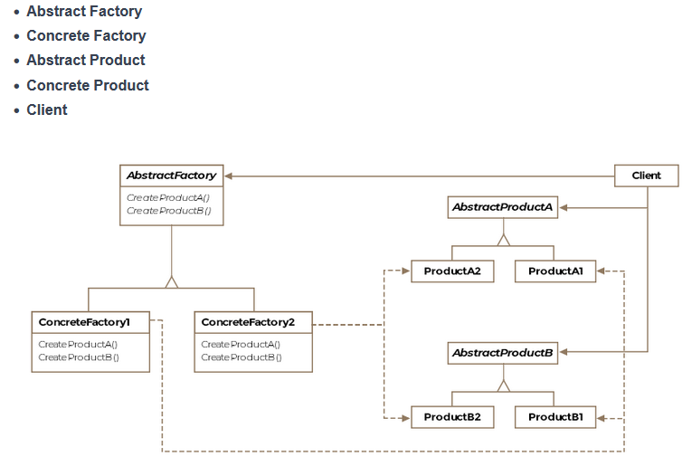

# Table of contents
- [Table of contents](#table-of-contents)
- [Abstract Factory Pattern](#abstract-factory-pattern)

# Abstract Factory Pattern 
This solves the problem of creating families of related products. Formally is defined as an interface to create families of related or dependent objects without specifying their concrete classes. 

An abstract factory can be thought of as a super factor or a factory of factories. The pattern achieves the creation of a family of product without revealing concrete classes to the client. 

## Code to an interface not to an implementation
One of the fundamental principles of good object orientated design is to hide the concrete classes and expose interfaces to clients. An object responds to a set of requests, these requests can be captured by an interface which the object's class implements. 

## Creating a factory 
Instead of new-ing up objects in client code, we'll have class responsible for manufacturing the requested objects and returning them to the client. 





## Django Project Example: Payment Processing

Let's consider a Django project where we need to create different types of payment processors (Credit Card, PayPal, and Bitcoin). We can use the Abstract Factory Pattern to achieve this.

### Step 1: Define Interfaces

First, we define interfaces for our payment processors.

```python
# payments/payment_processor.py
from abc import ABC, abstractmethod

class PaymentProcessor(ABC):
    @abstractmethod
    def process_payment(self, amount: float):
        pass
```

### Step 2: Implement Concrete Classes

Next, we implement concrete classes for each type of payment processor.

```python
# payments/credit_card_processor.py
from .payment_processor import PaymentProcessor

class CreditCardProcessor(PaymentProcessor):
    def process_payment(self, amount: float):
        print(f"Processing credit card payment of {amount}")

# payments/paypal_processor.py
from .payment_processor import PaymentProcessor

class PayPalProcessor(PaymentProcessor):
    def process_payment(self, amount: float):
        print(f"Processing PayPal payment of {amount}")

# payments/bitcoin_processor.py
from .payment_processor import PaymentProcessor

class BitcoinProcessor(PaymentProcessor):
    def process_payment(self, amount: float):
        print(f"Processing Bitcoin payment of {amount}")
```

### Step 3: Create Abstract Factory

Now, we create an abstract factory interface.

```python
# factories/payment_processor_factory.py
from abc import ABC, abstractmethod
from payments.payment_processor import PaymentProcessor

class PaymentProcessorFactory(ABC):
    @abstractmethod
    def create_payment_processor(self) -> PaymentProcessor:
        pass
```

### Step 4: Implement Concrete Factories

We then implement concrete factories for each type of payment processor.

```python
# factories/credit_card_processor_factory.py
from .payment_processor_factory import PaymentProcessorFactory
from payments.credit_card_processor import CreditCardProcessor

class CreditCardProcessorFactory(PaymentProcessorFactory):
    def create_payment_processor(self) -> CreditCardProcessor:
        return CreditCardProcessor()

# factories/paypal_processor_factory.py
from .payment_processor_factory import PaymentProcessorFactory
from payments.paypal_processor import PayPalProcessor

class PayPalProcessorFactory(PaymentProcessorFactory):
    def create_payment_processor(self) -> PayPalProcessor:
        return PayPalProcessor()

# factories/bitcoin_processor_factory.py
from .payment_processor_factory import PaymentProcessorFactory
from payments.bitcoin_processor import BitcoinProcessor

class BitcoinProcessorFactory(PaymentProcessorFactory):
    def create_payment_processor(self) -> BitcoinProcessor:
        return BitcoinProcessor()
```

### Step 5: Use the Factories

Finally, we use the factories in our Django views or services.

```python
# views.py or services.py
from factories.credit_card_processor_factory import CreditCardProcessorFactory
from factories.paypal_processor_factory import PayPalProcessorFactory
from factories.bitcoin_processor_factory import BitcoinProcessorFactory

def process_payments():
    credit_card_factory = CreditCardProcessorFactory()
    paypal_factory = PayPalProcessorFactory()
    bitcoin_factory = BitcoinProcessorFactory()

    credit_card_processor = credit_card_factory.create_payment_processor()
    paypal_processor = paypal_factory.create_payment_processor()
    bitcoin_processor = bitcoin_factory.create_payment_processor()

    credit_card_processor.process_payment(100.0)
    paypal_processor.process_payment(200.0)
    bitcoin_processor.process_payment(300.0)
```

This example demonstrates how to use the Abstract Factory Pattern in a Django project to create different types of payment processors without exposing the concrete classes to the client.
