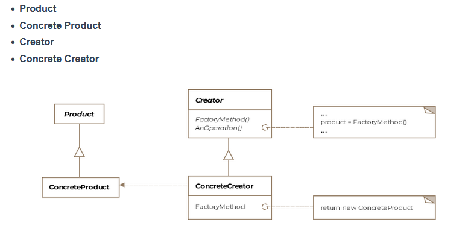

# Table of contents
- [Table of contents](#table-of-contents)
- [Factory Method Pattern](#factory-method-pattern)

# Factory Method Pattern 
A factory produces goods, and a software factory produces objects. Formally the factory method is defined as providing an interface for object creation but delegating the actual instantiation of objects to subclasses. 

The main goal of this pattern is to avoid to get married to a class because it can have changes or new versions, so we would have to modify each previous instantiation of the class. 

One way out, is to encapsulate the object creation in another object that is solely responsible for new-ing up the requested variants of a class. 




## Example Implementation in Django

To illustrate the Factory Method Pattern in Django, let's consider a scenario where we need to create different types of notifications (e.g., Email, SMS, Push Notification). 

### Step 1: Define the Product Interface

First, we define an interface for the product that will be created by the factory method.

```python
# notifications/notification.py
from abc import ABC, abstractmethod

class Notification(ABC):
    @abstractmethod
    def send(self, message: str):
        pass
```

### Step 2: Implement Concrete Products

Next, we implement concrete products that inherit from the `Notification` interface.

```python
# notifications/email_notification.py
from .notification import Notification

class EmailNotification(Notification):
    def send(self, message: str):
        print(f"Sending email with message: {message}")

# notifications/sms_notification.py
from .notification import Notification

class SMSNotification(Notification):
    def send(self, message: str):
        print(f"Sending SMS with message: {message}")

# notifications/push_notification.py
from .notification import Notification

class PushNotification(Notification):
    def send(self, message: str):
        print(f"Sending push notification with message: {message}")
```

### Step 3: Create the Factory Interface

Now, we define the factory interface that declares the factory method.

```python
# factories/notification_factory.py
from abc import ABC, abstractmethod
from notifications.notification import Notification

class NotificationFactory(ABC):
    @abstractmethod
    def create_notification(self) -> Notification:
        pass
```

### Step 4: Implement Concrete Factories

We then implement concrete factories that override the factory method to create specific types of notifications.

```python
# factories/email_notification_factory.py
from .notification_factory import NotificationFactory
from notifications.email_notification import EmailNotification

class EmailNotificationFactory(NotificationFactory):
    def create_notification(self) -> Notification:
        return EmailNotification()

# factories/sms_notification_factory.py
from .notification_factory import NotificationFactory
from notifications.sms_notification import SMSNotification

class SMSNotificationFactory(NotificationFactory):
    def create_notification(self) -> Notification:
        return SMSNotification()

# factories/push_notification_factory.py
from .notification_factory import NotificationFactory
from notifications.push_notification import PushNotification

class PushNotificationFactory(NotificationFactory):
    def create_notification(self) -> Notification:
        return PushNotification()
```


### Django Project Structure

Below is the structure of the Django project, which includes the `factories` and `notifications` directories where the factory and product classes are defined, respectively. The `views.py` file contains the view functions that use the factories to send notifications.

```
myproject/
    ├── myapp/
    │   ├── factories/
    │   │   ├── __init__.py
    │   │   ├── email_notification_factory.py
    │   │   ├── notification_factory.py
    │   │   ├── push_notification_factory.py
    │   │   └── sms_notification_factory.py
    │   ├── notifications/
    │   │   ├── __init__.py
    │   │   ├── email_notification.py
    │   │   ├── notification.py
    │   │   ├── push_notification.py
    │   │   └── sms_notification.py
    │   ├── __init__.py
    │   ├── admin.py
    │   ├── apps.py
    │   ├── models.py
    │   ├── tests.py
    │   └── views.py
    ├── manage.py
    └── myproject/
        ├── __init__.py
        ├── settings.py
        ├── urls.py
        └── wsgi.py
```

### Step 5: Integrate with Django Views

```python
# myapp/views.py
from django.http import HttpResponse
from .factories.email_notification_factory import EmailNotificationFactory
from .factories.sms_notification_factory import SMSNotificationFactory
# Function to send a notification using the provided factory and message
def send_notification(factory, message):
    notification = factory.create_notification()
    notification.send(message)

def notify_email(request):
    factory = EmailNotificationFactory()
    send_notification(factory, "Hello via Email!")
    return HttpResponse("Email notification sent.")

# Function to send an SMS notification
def notify_sms(request):
    factory = SMSNotificationFactory()
    send_notification(factory, "Hello via SMS!")
    return HttpResponse("SMS notification sent.")
    return HttpResponse("SMS notification sent.")

def notify_push(request):
    factory = PushNotificationFactory()
    send_notification(factory, "Hello via Push Notification!")
    return HttpResponse("Push notification sent.")
```

### Step 6: Configure URLs

```python
# myapp/urls.py
from django.urls import path
from . import views

urlpatterns = [
    path('notify/email/', views.notify_email, name='notify_email'),
    path('notify/sms/', views.notify_sms, name='notify_sms'),
    path('notify/push/', views.notify_push, name='notify_push'),
]
```

### Step 7: Update Project URLs

```python
# myproject/urls.py
from django.contrib import admin
from django.urls import path, include

urlpatterns = [
    path('admin/', admin.site.urls),
    path('myapp/', include('myapp.urls')),
]
```