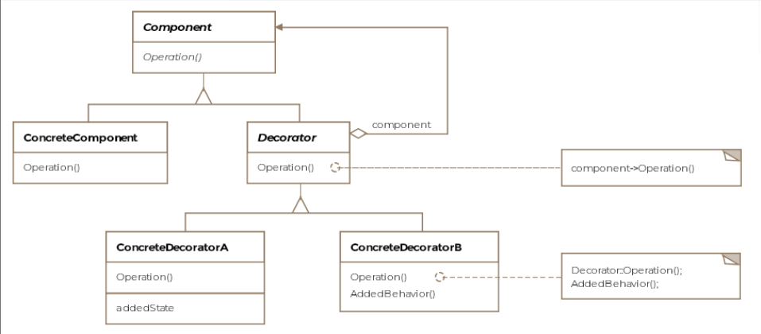

# Table of contents 
- [Table of contents](#table-of-contents)
- [Decorator Pattern](#decorator-pattern)
- [Class Diagram](#class-diagram)

# Decorator Pattern
The decorator pattern can be thought as a wrapper or more formally a way to enhance or extend the behavior of an object dynamically. The pattern provides an alternative to subclassing when new functionality is desired.

The strategy is to wrap the existing object within a decorator object that usually implements the same interface as the wrapped object. This allows the decorator to invoke the methods on the wrapped object and then add any additional behavior. 

# Class Diagram 



Basically this pattern allows a method to act as it is implemented but adding extra functionality without affecting its own functionality. It uses the following key concepts: 

1. Component: The interface or abstract class defining the methods that will be implemented. 
2. Concrete Component: The class that implements the Component interface. 
3. Decorator: An abstract class that implements the Component interface and contains a reference to a Component object. 
4. Concrete decorators: Classes that extend the Decorator class and add additional behavior. 


# Example in a Django Project 
Consider a scenario where you have a View that needs to log requests and check user authentication. Instead of adding these functionalities directly to the view, you can use decorators to add these behaviors dynamically. 

## Step 1. Define the component interface creating an abstract base class for the view. 
```python
from abc import ABC, abstractmethod


class View(ABC):
    @abstractmethod
    def handle_request(self, request):
        pass
```

## Step 2. Define the concrete component: Create a concrete class that implements the View interface 
```python 
class ConcreteView(View):
    def handle_request(self, request):
        return "Handling request in ConcreteView"
```

## Step 3. Define the decorator: Create an abstract decorator class that implements the View interface and contains a reference to a View object
```python 
class ViewDecorator(View):
    def __init__(self, view):
        self._view = view 

    def hanlde_request(self, request):
        return self._view.hanlde_request(request)
```

## Step 4. Define concrete decorators that extend the ViewDecorator class and add additional behavior 
```python 
class LoggingDecorator(ViewDecorator):
    def hanlde_request(self, request):
        print(f"Logging request: {request}")
        return super().handle_request(request)


class AuthenticationDecorator(ViewDecorator):
    def handle_request(self, request):
        if not request.user.is_authenticated:
            return "User not authenticated"
        return super().handle_request(request)
```


## Step 5. Use the decorators to add logging and authentication to the view 
```python 
# views.py
from django.http import HttpRequest

# Create a concrete view
view = ConcreteView()

# Wrap the view with logging and authentication decorators
view = LoggingDecorator(view)
view = AuthenticationDecorator(view)

# Simulate a request
request = HttpRequest()
request.user = type('User', (object,), {'is_authenticated': True})()

# Handle the request
response = view.handle_request(request)
print(response)  # Output: Logging request: <HttpRequest object> \n Handling request in ConcreteView
```