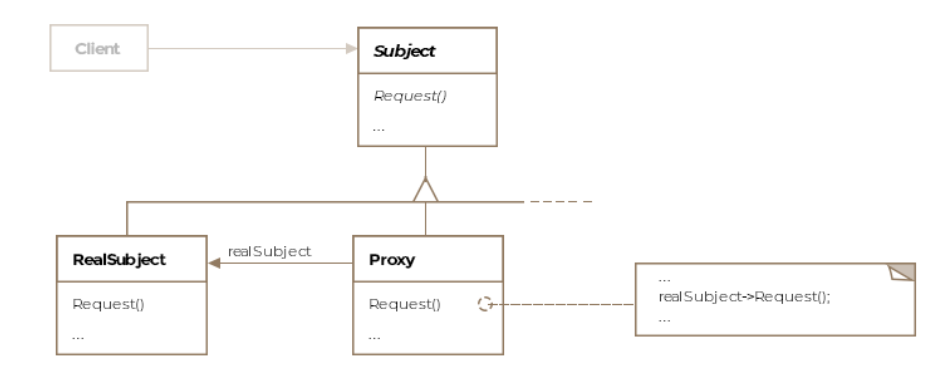

# Table of contents 
- [Table of contents](#table-of-contents)

# Proxy Pattern 
The literal definition of proxy is the authority to represent someone else. In a proxy pattern setup, a proxy is responsible for representing another object called the subject in front of clients. The real subject is shielded from interacting directly with the clients. There could be several reasons why one would want to fron a subject with a proxy, some are listed below: 

- To access remote objects over the internet, running in another JVM or another addess space 
- To protect a subject from clients not authorized to access it 
- To stand in place of an object that may ne expensive to create and delay object's creation till it is accessed. 
- To cache queries or results from subject for clients 
- There are a number of other use cases such as the firewall proxy, synchronization proxy etc. 

Formally, the pattern is defined as a mechanism to provide a surrogate or placeholder for another object to controll access to it. 


# Class Diagram 


# Use cases 
- Remote Proxy: Accessing objects that reside in different address spaces, such as on a different server or in a different JVM.
- Virtual Proxy: Delaying the creation and initialization of expensive objects until they are actually needed.
- Protection Proxy: Controlling access to sensitive objects by checking permissions or other access controls.
- Caching Proxy: Caching the results of expensive operations to improve performance.
- Logging Proxy: Logging requests and responses to monitor interactions with the real object.


# Remote Proxy 
Represents an object located in a different address space. It handles the communication between the client and the remote object.
Use Case: Accessing a remote service or API. **Accessing a remote service or API.**
# Virtual Proxy
Delays the creation and initialization of an expensive object until it is actually needed. **Lazy loading of large data sets or resources.**
# Protection Proxy 
Controls access to an object by checking permissions or other access controls. **Implementing security measures to restrict access to sensitive data or operations.**


# Example in a Django Project 
Consider a scenario where you have a large image file that is expensive to load and you want to use a virtual proxy to delay loading the image until it is actually needed. 

## Define the subject interface
Create an interface that both the real object and the proxy will implement

```python
# subject.py
from abc import ABC, abstractmethod


class Image(ABC):
    @abstractmethod 
    def display(self):
        pass
```

## Define the real subject 
Create the real object that the proxy will represent 

```python 
# real_subject.py
from .subject import Image 


class RealImage(Image): 
    def __init__(self, filename):
        self.filename = filename
        self.load_image_from_disk()

    def load_image_from_disk(self):
        print(f"Loading image from disk: {self.filename}")

    def display(self):
        print(f"Displayingimage: {self.filename}")
```


## Define the Proxy
Create the proxy object that ocntrols access to the real object 

```python
# proxy.py
from .subject import Image
from .real_subject import RealImage

class ProxyImage(Image):
    def __init__(self, filename):
        self.filename = filename
        self.real_image = None

    def display(self):
        if self.real_image is None:
            self.real_image = RealImage(self.filename)
        self.real_image.display()
```


## Usage example
Use the proxy in your django views to control access to the real object 
```python
# views.py
from django.http import HttpResponse
from .proxy import ProxyImage

def display_image(request, filename):
    image = ProxyImage(filename)
    image.display()
    return HttpResponse(f"Image {filename} displayed.")
```
