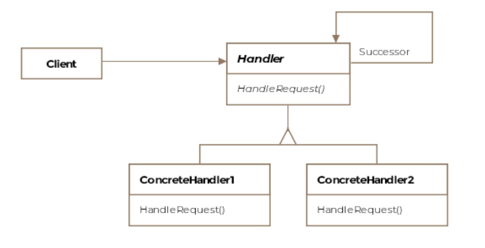

# Table of contents 
- [Table of contents](#table-of-contents)
- [Chain of Responsibility Pattern](#chain-of-responsibility-pattern)
- [Class Diagram](#class-diagram)
- [Use Cases](#use-cases)
- [Example in a Django Project](#example-in-a-django-project)
  - [Define the handler interface](#define-the-handler-interface)
  - [Define Concrete Handlers](#define-concrete-handlers)
  - [Usage Example](#usage-example)

# Chain of Responsibility Pattern
In a chain of responsibility pattern implementation, the sender's request is passed down a series of handler objects till one of those object, handles the request or it remains unhandled and falls off the chain. Multiple objects are given a chance to handle the request. This allows us to decouple the sender and the receiver of a request. 

Formally the pattern is defined as decoupling the sender of a request from its receiver by chaining the receiving objects together and passing the request along the chain until an object handles it. Usually the pattern is applied when the request can be handled by multiple objects and it is not know in advance which object will end up handling the request. 

1. **Handler Interface**: Defines an interface for handling requests and setting the next handler in the chain. 
2. **Concrete Handlers**: Implement the handler interface and handle the request or pass it to the next handler.
3. **Client**: Initiates the request and passes it to the first handler in the chain. 

# Class Diagram 


# Use Cases 
1. **Event Handling Systems**: Handling events where multiple listeners can process the event. 
2. **Logging Systems**: Different loggers handle different levels of logging (e.g. debug, info, error). 
3. **Form Validation**: Validating form inputs where each validator checks a specific condition. 
4. **Authorization**: Checking user permissions where each handler checks a specific permission. 


# Example in a Django Project
Let's consider a scenario where you have a request processing system that involves multiple steps, such as authentication, authorization, and logging. Each step can be handled by a different handler in the chain. 

## Define the handler interface
Create an abstract base class for the handlers. 

```python 
# handlers.py 
from abc import ABC, abstractmethod


class Handler(ABC): 
    def __init__(self):
        self.next_handler = None 

    def set_next(self, handler):
        self.next_handler = handler 
        return handler
    
    @abstractmethod
    def handle(self, request):
        if self.next_handler:
            return self.next_handler.handle(request)
        return None
``` 

## Define Concrete Handlers 
Implement the concrete handlers for authentication, authorization, and logging. 

```python 
# concrete_handlers.py 
from .handlers import Handler 


class AuthenticationHandler(Handler):
    def handle(self, request):
        if not request.user.is_authenticated:
            return "User not authenticated"
        return super().handle(request)
    

class AuthorizationHandler(Handler):
    def handle(self, request):
        if not request.user.has_perm('app.view_resource'):
            return "User not authorized"
        return super().handle(request)


class LoggingHandler(Handler):
    def handle(self, request):
        print(f"Request by user: {request.user}")
        return super().handle(request)
```

## Usage Example
Use the chain of responsibility in your django views to process requests. 

```python 
# views.py 
from django.http import HttpResponse
from .concrete_handlers import AuthenticationHandler, AuthorizationHandler, LoggingHandler

def process_request(request):
    auth_handler = AuthenticationHandler()
    authz_handler = AuthorizationHandler()
    log_handler = LoggingHandler()

    auth_handler.set_next(authz_handler).set_next(log_handler)

    response = auth_handler.handle(request)

    if response:
        return HttpResponse(response)
    return HttpResponse("Request processed Succesfully")
```
