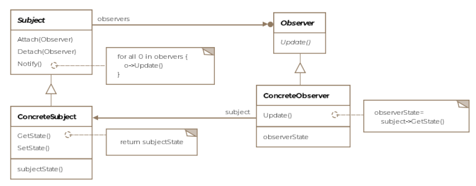

# Table of contents 
- [Table of contents](#table-of-contents)
- [Observer Pattern](#observer-pattern)
- [Class Diagram](#class-diagram)
- [Caveats](#caveats)
- [Use cases](#use-cases)
- [Example in Django Project.](#example-in-django-project)
  - [Define the subject interface](#define-the-subject-interface)
  - [Define the observer interface](#define-the-observer-interface)
  - [Define the Concrete Subject](#define-the-concrete-subject)
  - [Define the Concrete Observer](#define-the-concrete-observer)
  - [Usage example](#usage-example)

# Observer Pattern
Social media helps us immensely in understanding the observer pattern. If you are registered on instagram, you are essentially asking Instagram to send you(the observer) new posts of the person(the subject) you followed. The pattern consists of two actors, the observer who is interested in the updates and the subject who generates the updates. 

A subject can have many observers and is a one to many relationship. The pattern is formally defined as **a one to many dependency between objects so that when one object changes state all the dependents are notified.**

# Class Diagram 




# Caveats 
Some issues one needs to keep in mind while working with the observer pattern. 

- In case of many subjects and few observers, if each subject stores its observers separately, it'll increase the storage costs as some subjects will be storing the same observer multiple times. 
- A small change in the subject, may lead to a cascade of updates for the observers and their dependent objects. If clients invoke notify on the subject after each change, it can overwhelm the observers with updates, whereas another option can be to batch the changes and then invoke notify on the subject. 
- Usually, another entity Change Manager can sit between the observers and the subject in case there are compplex dependencies between the subject and the observers 

# Use cases 
1. **Event handling systems**: Implementing event listeners and handlers. 
2. **Data Binding**: Synchronizing data between models and views. 
3. **Notification Systems**: Sending notifications to multiple suscribers when an event occurs. 
4. **Real-time Updates**: Updating user interfaces in real-time when the underlying data changes. 

# Example in Django Project. 
Let's consider a scenario where you have a blog application, and you want to notify suscribers whenever a new post is published. 

## Define the subject interface
Create an abstract class for the subject. 

```python 
# subject.py 
from abc import ABC, abstractmethod 


class Subject(ABC):
    def __init__(self):
        self._observers = []

    def attach(self, observer):
        self._observers.append(observer)

    def detach(self, observer):
        self._observers.remove(observer)

    def notify(self):
        for observer in self._observers:
            observer.update(self)

    @abstractmethod
    def get_state(self):
        pass
```

## Define the observer interface 
Create an abstract base class for the observer

```python 
# observer.py 
from abc import ABC, abstractmethod 


class Observer(ABC):
    @abstractmethod
    def update(self, subject):
        pass 
```


## Define the Concrete Subject 
Implement the concrete subject that holds the state

```python 
# models.py 
from django.db import models 
from .subject import Subject 


class BlogPost(Subject, models.Model):
    title = models.Charfield(max_length=255)
    content = models.TextField()

    def save(self, *args, **kwargs):
        super().save(*args, **kwargs)
        self.notify()

    def get_state(self):
        return self.title

    def __str__(self):
        return self.title
```


## Define the Concrete Observer
Implement the concrete observer that reacts to changes in the subject. 

```python 
# observers.py 
from .observer import Observer


class EmailSuscriber(Observer):
    def update(self, subject):
        # Logic to send email notification
```

## Usage example
Attach observers to the subject and save a new blog post 

```python 
# views.py 
from django.http import HttpResponse
from .models import BlogPost
from .observers import EmailSuscriber 

def create_blog_post(request):
    post = BlogPost(title="New Post", content="This is a blog post")

    email_suscriber = EmailSuscriber()
    post.attach(email_suscriber)
    
    post.save()

    return HttpResponse("Blog post created and suscribers notified.")
```