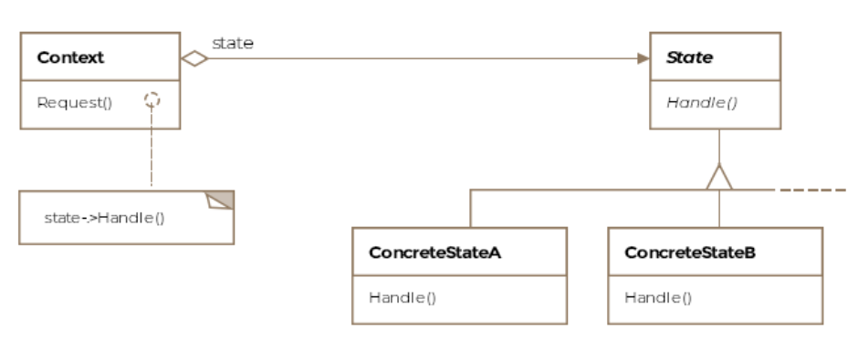

# Table of contents
- [Table of contents](#table-of-contents)

# State Pattern
The state pattern will be reminiscent of automata class from your undergraduate degree as it involves state transitions for an object. The state pattern encapsulates the various states a machine can be in. 

The machine or the context, as it is called in pattern-speak, can have actions taken on it that propel it into different states. Without the use of the pattern, the code becomes inflexible and littered with if-else conditionals

Formally, the pattern is defines as **allowing an object to alter behavior when its internal state changes so that it appears to change its class**.

## How it works 
1. **Context**: The object whose behavior changes based on its state. 
2. **State Interface**: An interface that declares the methods that each state should implement 
3. **Concrete States**: Classes that implement the state interface and define behavior for specific states. 

# Use Cases 
1. **State Machines**: Implementing state machines where an object transitions between different states
2. **Workflow Systems**: Managing different stages of a workflow. 
3. **Game Development**: Handling different states of a game character(i.e. running, jumping, resting)
4. **UI Components**: Managing different states of UI components(i.e. enabled, disabled, focused)

# Class Diagram 


# Example in a Django Project
Let's consider a scenario where you have an order processing system, and an order can be in different states such as "Pending", "Shipped", and "Delivered". The behavior of the order changes based on its state. 

## Define the State Interface 
Create an interface that declares the methods for state-specific behavior 

```python 
# states.py 
from abc import ABC, abstractmethod 


class OrderState(ABC):
    @abstractmethod
    def handle(self, order):
        pass
```

## Define concrete states
Implement the concrete states that define behavior for specific states. 

```python 
# concrete_states.py 
from .states import OrderState


class PendingState(OrderState):
    def handle(self, order):
        print("Order is pending")
        order.set_state(ShippedState())

    
class ShippedState(OrderState):
    def handle(self, order):
        print("Order is shipped")
        order.set_state(DeliveredState())


class DeliveredState(OrderState):
    def handle(self, order):
        print("Order is delivered")
```

## Define the context
Implement the context that maintains an instance of a concrete state and delegates state-specific behavior to the current state. 

```python 
# context.py 
from .concrete_states import PendingState


class Order:
    def __init__(self):
        self._state = PendingState()

    def set_state(self, state):
        self._state = state 

    def process_order(self):
        self._state.handle(self)
```

## Usage Example 
In a django view we can manage now the order states 

```python 
# views.py 
from django.http import HttpResponse
from .context import Order 

def process_order_view(request):
    order = Order()

    order.process_order()
    order.process_order()
    order.process_order()

    return HttpResponse("Order processed through states.")
```
