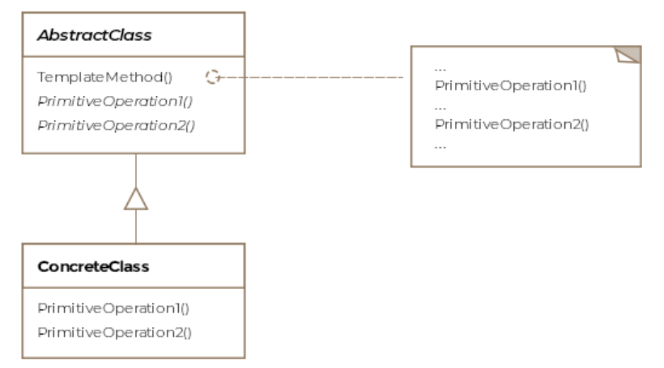

# Table of contents 
- [Table of contents](#table-of-contents)

# Template Method 
A template can be thought of as a general or abstract structure that can be customized for specific situations. It defines the skeleton or steps of an algorithm but leaves opportunities for subclasses to override some of the steps with their own implementations. 

Formally, the patterns is defined as **allowing subclasses to define parts of an algorithm without modifying the overall structure of the algorithm**. 

The template method pattern factors out the common code among its subclasses and puts them into the abstract class. The variable parts of the algorithm are left for the subclasses to override. These parts are template methods. A **template method** defines an algorithm in terms of abstract operations that subclasses override to provide concrete behavior. 

## How it Works 
1. **Abstract Class**: Defines the template method and declares abstract methods for the steps that need to be implemented by subclasses. 
2. **Template Method**: A method in the abstract class that defines the algorithm's structure and calls the abstract methods. 
3. **Concrete Class**: Implements the abstract methods defined in the abstract class. 

# Use Cases
1. **Code Reuse**: When you have multiple classes that share a common algorithm but differ in specific steps. 
2. **Frameworks**: When building frameworks that allow users to extend and customize certain parts of the algorithm. 
3. **Data Processing**: When processing data in a series of steps where some steps can be customized. 

# Class Diagram 


# Example in Django Project
Let's consider a scenario where you have a report generation system, and you want to generate different types of reports(i.e. PDF, CSV, XLSX) using the same algorithm but with different implementations for specific steps. 

## Define the Abstract Class
Create an abstract class that defines the template method and declares abstract methods for the steps that need to be implemented by subclasses 

```python 
# report_generator.py
from abc import ABC, abstractmethod 


class ReportGenerator(ABC):
    def generate_report(self):
        self.fetch_data()
        self.format_data()
        self.save_report()

    @abstractmethod
    def fetch_data(self):
        pass

    @abstractmethod
    def format_data(self):
        pass

    @abstractmethod
    def save_report(self):
        pass 
```

## Define the Concrete Classes
Implement the concrete classes that provide specific implementations for the abstract methods

```python 
# pdf_report_generator.py
from .report_generator import ReportGenerator

class PDFReportGenerator(ReportGenerator):
    def fetch_data(self):
        self.data = "PDF Report Data"
        print("Fetching data for PDF report")

    def format_data(self):
        self.formatted_data = f"Formatted {self.data}"
        print("Formatting data for PDF report")

    def save_report(self):
        print(f"Saving PDF report: {self.formatted_data}")

# csv_report_generator.py
from .report_generator import ReportGenerator

class CSVReportGenerator(ReportGenerator):
    def fetch_data(self):
        self.data = "CSV Report Data"
        print("Fetching data for CSV report")

    def format_data(self):
        self.formatted_data = f"Formatted {self.data}"
        print("Formatting data for CSV report")

    def save_report(self):
        print(f"Saving CSV report: {self.formatted_data}")
```

## Usage Example
Use the template pattern in a view to generate different types of reports 

```python 
# views.py 
from django.http import HttpResponse 
from .pdf_report_generator import PDFReportGenerator
from .csv_report_generator import CSVReportGenerator

def generate_pdf_report(request):
    report_generator = PDFReportGenerator()
    report_generator.generate_report()

    return HttpResponse("PDF report generated")

def generate_csv_report(request):
    report_generator = CSVReportGenerator()
    report_generator.generate_report()

    return HttpResponse("CSV report generated")
```