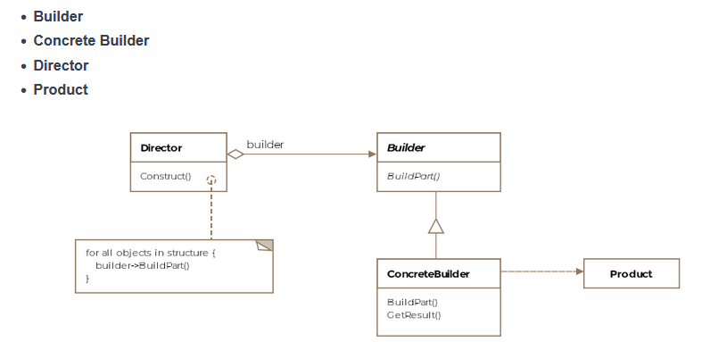

# Table of contents 
- [Table of contents](#table-of-contents)
- [Builder Pattern](#builder-pattern)
  - [What is it?](#what-is-it)
  - [Class Diagram](#class-diagram)
- [Builder Pattern Example in Python](#builder-pattern-example-in-python)
  - [Example](#example)
    - [House Class](#house-class)
    - [HouseBuilder Class](#housebuilder-class)
    - [Director Class](#director-class)
    - [Usage](#usage)
    - [Output](#output)
  - [Another Example: Building a Software Configuration](#another-example-building-a-software-configuration)
    - [SoftwareConfiguration Class](#softwareconfiguration-class)
    - [SoftwareConfigurationBuilder Class](#softwareconfigurationbuilder-class)
    - [Director Class](#director-class-1)
    - [Usage](#usage-1)
    - [Output](#output-1)

# Builder Pattern

## What is it? 
Formally, a builder pattern encapsulates or hides the process of building a complex object and separates the representation of the object and its construction. The separation allows us to construct different representations using the same construction process. 

## Class Diagram 


# Builder Pattern Example in Python

The Builder Pattern is a creational design pattern that allows you to construct complex objects step by step. It separates the construction of a complex object from its representation, allowing the same construction process to create different representations.

## Example

Let's create an example of a builder pattern to construct a `House` object.

### House Class

```python
class House:
        def __init__(self):
                self._walls = None
                self._roof = None
                self._windows = None
                self._doors = None

        def __str__(self):
                return f'House with {self._walls} walls, {self._roof} roof, {self._windows} windows, and {self._doors} doors.'

        def set_walls(self, walls):
                self._walls = walls

        def set_roof(self, roof):
                self._roof = roof

        def set_windows(self, windows):
                self._windows = windows

        def set_doors(self, doors):
                self._doors = doors
```

### HouseBuilder Class

```python
class HouseBuilder:
        def __init__(self):
                self.house = House()

        def build_walls(self, walls):
                self.house.set_walls(walls)
                return self

        def build_roof(self, roof):
                self.house.set_roof(roof)
                return self

        def build_windows(self, windows):
                self.house.set_windows(windows)
                return self

        def build_doors(self, doors):
                self.house.set_doors(doors)
                return self

        def get_house(self):
                return self.house
```

### Director Class

```python
class Director:
        def __init__(self, builder):
                self._builder = builder

        def construct_house(self):
                self._builder.build_walls("brick").build_roof("tile").build_windows(4).build_doors(2)
                return self._builder.get_house()
```

### Usage

```python
if __name__ == "__main__":
        builder = HouseBuilder()
        director = Director(builder)
        house = director.construct_house()
        print(house)
```

### Output

```
House with brick walls, tile roof, 4 windows, and 2 doors.
```

In this example, the `HouseBuilder` class provides methods to set different parts of the `House` object. The `Director` class uses the builder to construct a `House` object step by step.


## Another Example: Building a Software Configuration

This example will demonstrate how the builder pattern can be used in a software development project to create complex configurations with multiple options.

### SoftwareConfiguration Class

```python
class SoftwareConfiguration:
        def __init__(self):
                self._database = None
                self._cache = None
                self._message_queue = None
                self._logging = None

        def __str__(self):
                return f'SoftwareConfiguration with {self._database} database, {self._cache} cache, {self._message_queue} message queue, and {self._logging} logging.'

        def set_database(self, database):
                self._database = database

        def set_cache(self, cache):
                self._cache = cache

        def set_message_queue(self, message_queue):
                self._message_queue = message_queue

        def set_logging(self, logging):
                self._logging = logging
```

### SoftwareConfigurationBuilder Class

```python
class SoftwareConfigurationBuilder:
        def __init__(self):
                self.configuration = SoftwareConfiguration()

        def build_database(self, database):
                self.configuration.set_database(database)
                return self

        def build_cache(self, cache):
                self.configuration.set_cache(cache)
                return self

        def build_message_queue(self, message_queue):
                self.configuration.set_message_queue(message_queue)
                return self

        def build_logging(self, logging):
                self.configuration.set_logging(logging)
                return self

        def get_configuration(self):
                return self.configuration
```

### Director Class

```python
class Director:
        def __init__(self, builder):
                self._builder = builder

        def construct_full_configuration(self):
                self._builder.build_database("PostgreSQL").build_cache("Redis").build_message_queue("RabbitMQ").build_logging("ELK")
                return self._builder.get_configuration()

        def construct_minimal_configuration(self):
                self._builder.build_database("SQLite").build_logging("Console")
                return self._builder.get_configuration()
```

### Usage

```python
if __name__ == "__main__":
        builder = SoftwareConfigurationBuilder()
        director = Director(builder)

        full_config = director.construct_full_configuration()
        print(full_config)

        minimal_config = director.construct_minimal_configuration()
        print(minimal_config)
```

### Output

```
SoftwareConfiguration with PostgreSQL database, Redis cache, RabbitMQ message queue, and ELK logging.
SoftwareConfiguration with SQLite database, None cache, None message queue, and Console logging.
```

In this example, the `SoftwareConfigurationBuilder` class provides methods to set different parts of the `SoftwareConfiguration` object. The `Director` class uses the builder to construct different types of `SoftwareConfiguration` objects step by step. This demonstrates how the builder pattern can be used to create complex configurations with various options in a software development project.
