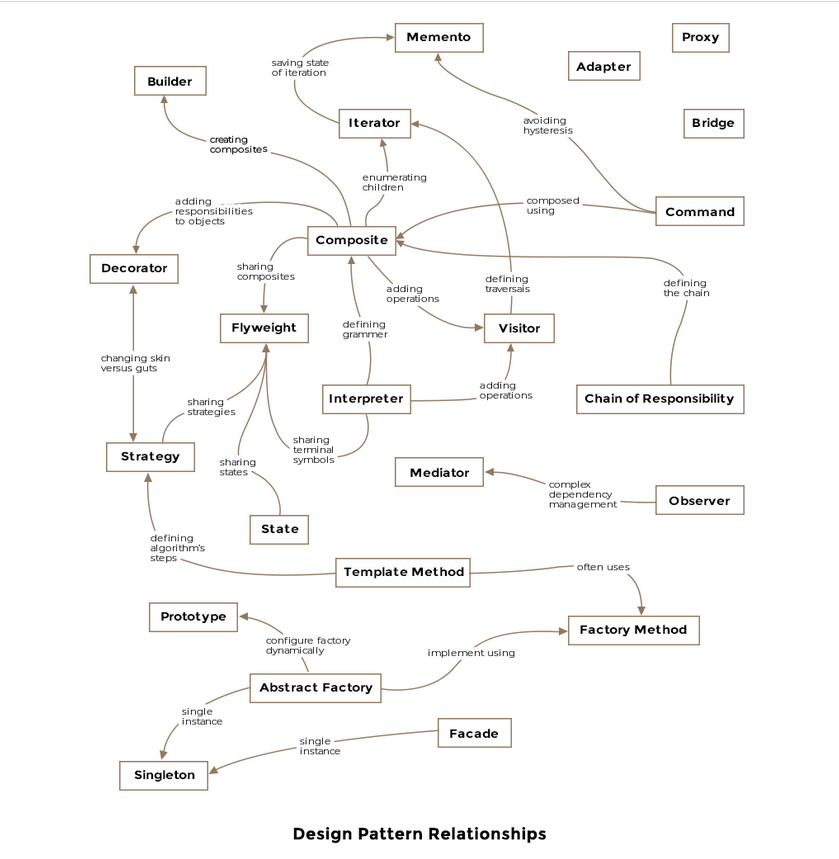

# Table of contents 
- [Table of contents](#table-of-contents)
- [Introduction](#introduction)
  - [Why patterns?](#why-patterns)
- [Types of Design Patterns](#types-of-design-patterns)
  - [Creational](#creational)
  - [Structural](#structural)
  - [Behavioral](#behavioral)

# Introduction 

## Why patterns?

These are the reason for reusable pieces of modular code where the solution is prebuild so it can be adapted to a specific project. 

# Types of Design Patterns 
The most important ones are highlighted in the software development process.

## Creational

Creational design patterns relate to how objects are constructed from classes. New-ing up objects may sound trivial but unthoughtfully littering code with object instance creations can lead to headaches down the road. The creational design pattern come with powerful suggestions on how best to encapsulate the object creation process in a program. 
- **Builder Pattern**
- **Prototype Pattern**
- **Singleton Pattern**
- **Abstract Factory Pattern**

## Structural

Structural patterns are concerned with the composition of classes i.e. how are made up or constructed.
- Adapter Pattern
- Bridge Pattern
- Composite Pattern
- **Decorator Pattern**
- Facade Pattern
- Flyweight Pattern
- **Proxy Pattern**

## Behavioral

Behavioral design patterns dictate the interaction of classes and objects amongst eachother and the delegation of responsibility. 
- Interpreter Pattern
- Template Pattern
- Chain of Responsibility Pattern 
- Command Pattern 
- **Iterator Pattern**
- Mediator Pattern 
- Memento Pattern 
- **Observer Pattern** 
- State Pattern 
- Strategy Pattern 
- **Visitor Pattern** 

