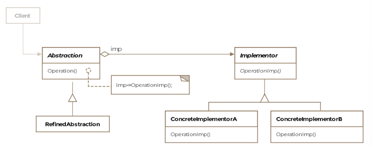

# Table of contents
- [Table of contents](#table-of-contents)
- [Bridge Pattern](#bridge-pattern)

# Bridge Pattern 
The bridge pattern can be applied to scenarios where the class and what it does changes often. Think of it as two layers of abstraction. The class itself becomes one layer and what it does o.e. the implementation becomes another layer. 

This setup allows us to extend the two layers independently of each other. 

Formally, the bridge pattern lets you vary the abstraction independently of the implementation, thus decoupling the two in the process. 




In the Bridge Pattern, you have two layers:

Abstraction: This is the high-level control layer for some functionality.
Implementation: This is the low-level layer that actually performs the work.
By separating these two layers, you can change the implementation without affecting the abstraction and vice versa.

# Django implementation 
Let's consider you have different types of notifications that can be sent to users. The abstraction here is the notification, and the implementation is the specific type of notification. 

## Step 1. Define the abstraction using the ABC and abstractmethod models from abc. 

```python
# notifications/abstraction.py
from abc import ABC, abstractmethod


class Notification(ABC):
    def __init__(self, implementation):
        self.implementation = implementation

    @abstractmethod 
    def send(self, message, user):
        pass
```

## Step 2: Define the implementations creating concrete classes for each type of notification. 

```python 
# notifications/implementations.py 


class EmailNotification: 
    def send(self, message, user):
        # Logic to send the email 
        print(f"Sending email to {user.email}: {message}")

class SMSNotification: 
    def send(self, message, user):
        # Logic to send the email 
        print(f"Sending SMS to {user.phone_number}: {message}")
```

## Step 3: Extend the Abstraction by creating concrete classes that can use the implementations

```python
# notifications/concrete_notifications.py 
from .abstracion.py import Notification


class UserNotification(Notification):
    def send(self, message, user):
        self.implementation.send(message, user)
```

## Setep 4: Use the bridge pattern in your Django views or services. 

```python 
# views.py 
from notifications.implementations import EmailNotification, SMSNotification
from notifications.concrete_notifications import UserNotification 

def send_notifications(request):
    user = request.user 

    if request.method == 'POST':
        message = request.POST.get("message")

        if request.POST.get("method_type") == 'email':
            try:
                email_notification = UserNotification(EmailNotification())
                email_notification.send(message, user)
            except: 
                print(f"Failed sending the notification")
        elif request.POST.get("method_type") == 'SMS':
            try:
                sms_notification = UserNotification(SMSNotification())
                sms_notification.send(message, user)
            except: 
                print(f"Failed sending the notification")


    return render(request, "notifications.html")
```