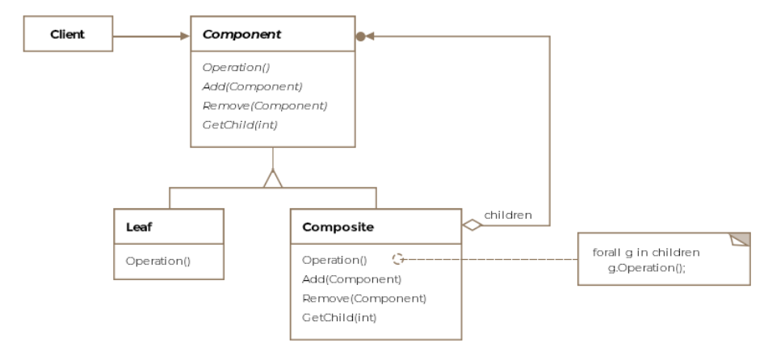

# Table of contents 
- [Table of contents](#table-of-contents)
- [Composite Pattern](#composite-pattern)
- [Use Cases](#use-cases)
  - [File Systems](#file-systems)
  - [Organizational structures.](#organizational-structures)
  - [UI Components](#ui-components)
- [Example of usage in Django](#example-of-usage-in-django)
  - [Usage example: We can create categories and subcategories and treat them uniformly](#usage-example-we-can-create-categories-and-subcategories-and-treat-them-uniformly)
- [We create the root category](#we-create-the-root-category)
- [We create the subcategories](#we-create-the-subcategories)
- [We add the sub categories to the root category](#we-add-the-sub-categories-to-the-root-category)

# Composite Pattern 
Composite literally means made up of various elements or parts. The pattern allows you to treat the whole and the individual parts as one. The closes analogy you can imagine is a tree. The tree is a recursive data-structure where each part itsel is a sub-tree except for the leaf nodes. The root is the top-level composite and its children are either composites themselves or just leaf nodes. 

Formally the composite pattern is defined as composing objects into tree structures to represent part-whole hierarchies, thus letting clients uniformly treat individual objects and comosition of objects. 




It allows us to compose objects into tree-like structures to represent part-whole hierarchies. This pattern lets clients treat individual objects and compositions of objects uniformly. The key concepts are the following: 
- Component: An abstract class/interface that declares common operations for both simple and complex objects. 
- Leaf: A class that represents simple objects in the composition. It implements the Component interface. 
- Composite: A class that represents complex objects that may contain other objects (both leafs and other composites). It also implements the Component interface and provides methods to add, remove and access child components. 

# Use Cases 
## File Systems 
A file system where directories can contain files and other directories. It allows you to treat files and directories uniformly, enabling operations like listing contents, calculating sizes, etc. 

## Organizational structures. 
An organization chart where employees can be managers(with subordinates) or individual contributors. Simplifies operations like calculating total salaries, printing organizational charts, etc.

## UI Components 
A graphical user interface where components can be simple elements (like buttons) or containers that hold other components. It enables uniform handling of rendering, event handling, etc. 

# Example of usage in Django
We can consider a scenario where we have a Category model, and each category can have subcategories(Which are also Category objects). 


```python 
from django.db import models


class CategoryComponent(models.Model):
    name = models.CharField(max_length=255)

    class Meta: 
        abstract = True 

    def __str__(self):
        return f"Category: {self.name}"

    def get_name(self):
        return self.name

    def get_children(self):
        raise NotImplementedError("This method should be overridden.")


class CategoryComposite(CategoryComponent):
    children = models.ManyToManyField('self', symetricla=False, related_name='parents')

    def add_child(self, child):
        self.children.add(child)

    def remove_child(self, child):
        self.children.remove(child)

    def get_children(self):
        return self.children.all() 


class CategoryLeaf(CategoryComponent):
    def get_children(self):
        return None # Leaf nodes do not have children 
``` 

## Usage example: We can create categories and subcategories and treat them uniformly 
```python
# We create the root category 
root_category = CategoryComposite.objects.create(name="Root Category")

# We create the subcategories 
sub_category1 = CategoryComposite.objects.create(name="Sub Category 1")
sub_category2 = CategoryLeaf.objects.create(name="Sub Category 2")

# We add the sub categories to the root category
root_category.add_child(sub_category1)
root_category.add_child(sub_category2)

for child in root_category.get_children():
    print(child.get_name())
